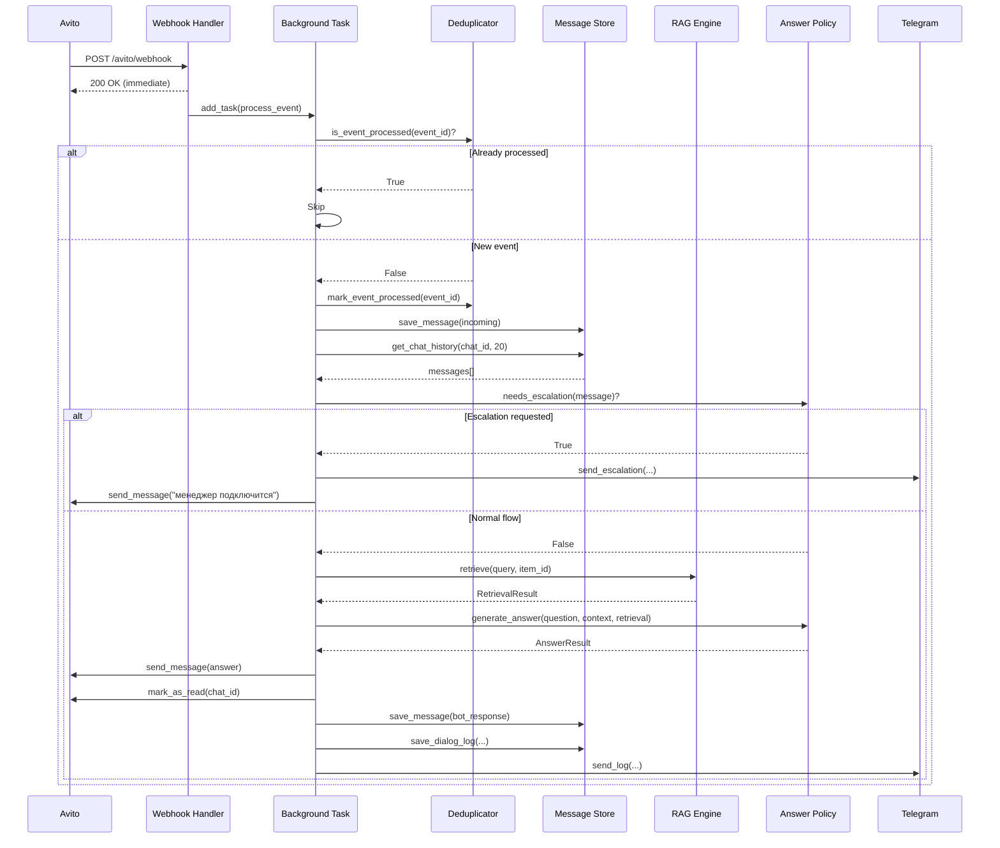
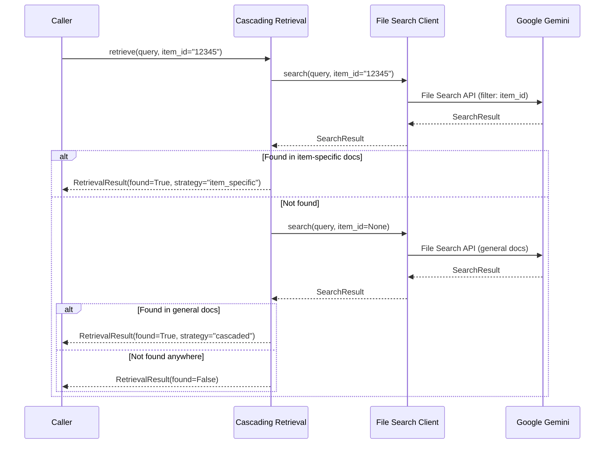

# Design Document: Avito AI Auto-Responder

## Overview

Avito AI Auto-Responder — асинхронный backend на Python 3.12 + FastAPI для автоматических ответов на сообщения покупателей в Avito. Система использует RAG (Retrieval-Augmented Generation) на базе Google Gemini File Search для генерации ответов, основанных исключительно на загруженной базе знаний.

### Ключевые архитектурные решения

1. **Асинхронная обработка** — webhook возвращает 200 OK мгновенно, обработка в BackgroundTasks
2. **Локальное хранение истории** — SQLite хранит все сообщения, так как Avito API возвращает только последнее
3. **Каскадный RAG** — сначала поиск по item_id, затем в общих документах
4. **Жёсткий анти-галлюцинационный контракт** — ответ только при наличии citations

## Architecture

```
┌─────────────────────────────────────────────────────────────────────────────┐
│                              Ubuntu VDS                                      │
│  ┌─────────────────────────────────────────────────────────────────────────┐│
│  │                         FastAPI Application                              ││
│  │  ┌──────────────┐  ┌──────────────┐  ┌──────────────┐  ┌─────────────┐ ││
│  │  │   Webhook    │  │    Token     │  │  Messenger   │  │  Telegram   │ ││
│  │  │   Handler    │  │   Manager    │  │   Client     │  │  Notifier   │ ││
│  │  └──────┬───────┘  └──────┬───────┘  └──────┬───────┘  └──────┬──────┘ ││
│  │         │                 │                 │                 │         ││
│  │         ▼                 ▼                 ▼                 ▼         ││
│  │  ┌──────────────────────────────────────────────────────────────────┐  ││
│  │  │                      Auto Responder Core                          │  ││
│  │  │  ┌─────────────┐  ┌─────────────┐  ┌─────────────┐               │  ││
│  │  │  │ Deduplicator│  │Message Store│  │Answer Policy│               │  ││
│  │  │  └─────────────┘  └─────────────┘  └─────────────┘               │  ││
│  │  └──────────────────────────┬───────────────────────────────────────┘  ││
│  │                             │                                           ││
│  │                             ▼                                           ││
│  │  ┌──────────────────────────────────────────────────────────────────┐  ││
│  │  │                        RAG Engine                                 │  ││
│  │  │  ┌─────────────────┐  ┌─────────────────┐                        │  ││
│  │  │  │ File Search     │  │ Cascading       │                        │  ││
│  │  │  │ Client          │  │ Retrieval       │                        │  ││
│  │  │  └─────────────────┘  └─────────────────┘                        │  ││
│  │  └──────────────────────────────────────────────────────────────────┘  ││
│  │                             │                                           ││
│  │                             ▼                                           ││
│  │  ┌──────────────────────────────────────────────────────────────────┐  ││
│  │  │                      SQLite Storage                               │  ││
│  │  │  • processed_events  • messages  • dialog_logs  • tokens         │  ││
│  │  └──────────────────────────────────────────────────────────────────┘  ││
│  └─────────────────────────────────────────────────────────────────────────┘│
└─────────────────────────────────────────────────────────────────────────────┘
                │                                           │
                ▼                                           ▼
        ┌───────────────┐                          ┌───────────────┐
        │  Avito API    │                          │ Google Gemini │
        │  Messenger    │                          │ File Search   │
        └───────────────┘                          └───────────────┘
```

## Components and Interfaces

### 1. Config (app/config.py)

Pydantic Settings для загрузки конфигурации из ENV.

```python
class Settings(BaseSettings):
    # Avito OAuth2
    avito_client_id: str
    avito_client_secret: str
    avito_user_id: str
    avito_webhook_url: str

    # Google Gemini
    gemini_api_key: str
    file_search_store_name: str

    # Telegram
    telegram_bot_token: str
    telegram_owner_chat_id: str

    # App
    app_base_url: str
    database_url: str = "sqlite:///./data/avito_responder.db"
    message_context_limit: int = 20

    model_config = SettingsConfigDict(env_file=".env")
```

### 2. Token Manager (app/avito/oauth.py)

Управление OAuth2 токенами с кэшированием и автообновлением.

```python
class TokenManager:
    async def get_token(self) -> str:
        """Возвращает валидный access token, обновляя при необходимости."""

    async def refresh_token(self) -> str:
        """Принудительное обновление токена."""

    async def _fetch_token(self) -> TokenResponse:
        """Запрос нового токена через client_credentials."""
```

**Интерфейс TokenResponse:**

```python
class TokenResponse(BaseModel):
    access_token: str
    token_type: str
    expires_in: int
    obtained_at: datetime = Field(default_factory=datetime.utcnow)

    @property
    def is_expired(self) -> bool:
        return datetime.utcnow() > self.obtained_at + timedelta(seconds=self.expires_in - 60)
```

### 3. Messenger Client (app/avito/messenger_client.py)

HTTP клиент для Avito Messenger API.

```python
class MessengerClient:
    async def get_messages(self, chat_id: str, limit: int = 1) -> list[Message]:
        """GET /messenger/v3/accounts/{user_id}/chats/{chat_id}/messages/"""

    async def send_message(self, chat_id: str, text: str) -> SendResult:
        """POST /messenger/v1/accounts/{user_id}/chats/{chat_id}/messages"""

    async def mark_as_read(self, chat_id: str) -> None:
        """POST /messenger/v1/accounts/{user_id}/chats/{chat_id}/read"""

    async def register_webhook(self, url: str) -> None:
        """POST /messenger/v3/webhook"""
```

### 4. Webhook Models (app/avito/webhook_models.py)

Pydantic модели для webhook payload.

```python
class WebhookPayload(BaseModel):
    id: str  # event_id для дедупликации
    type: str  # "message" | "other"
    payload: MessagePayload

class MessagePayload(BaseModel):
    chat_id: str
    user_id: str
    message: MessageContent
    context: Optional[ChatContext] = None

class MessageContent(BaseModel):
    id: str
    type: str  # "text" | "system" | "image" | etc.
    text: Optional[str] = None
    created: datetime
    author_id: str

class ChatContext(BaseModel):
    item_id: Optional[str] = None
    item_title: Optional[str] = None
```

### 5. Storage Interface (app/storage/base.py)

Абстрактный интерфейс для хранилища (SQLite/PostgreSQL).

```python
class StorageInterface(ABC):
    @abstractmethod
    async def is_event_processed(self, event_id: str) -> bool: ...

    @abstractmethod
    async def mark_event_processed(self, event_id: str) -> None: ...

    @abstractmethod
    async def save_message(self, msg: StoredMessage) -> None: ...

    @abstractmethod
    async def get_chat_history(self, chat_id: str, limit: int) -> list[StoredMessage]: ...

    @abstractmethod
    async def save_dialog_log(self, log: DialogLog) -> None: ...
```

### 6. SQLite Storage (app/storage/sqlite.py)

Реализация StorageInterface для SQLite.

**Схема БД:**

```sql
CREATE TABLE processed_events (
    event_id TEXT PRIMARY KEY,
    processed_at TIMESTAMP DEFAULT CURRENT_TIMESTAMP
);

CREATE TABLE messages (
    id INTEGER PRIMARY KEY AUTOINCREMENT,
    chat_id TEXT NOT NULL,
    message_id TEXT UNIQUE,
    sender_id TEXT NOT NULL,
    text TEXT,
    is_bot_message BOOLEAN DEFAULT FALSE,
    item_id TEXT,
    created_at TIMESTAMP NOT NULL,
    stored_at TIMESTAMP DEFAULT CURRENT_TIMESTAMP
);
CREATE INDEX idx_messages_chat_id ON messages(chat_id, created_at DESC);

CREATE TABLE dialog_logs (
    id INTEGER PRIMARY KEY AUTOINCREMENT,
    chat_id TEXT NOT NULL,
    item_id TEXT,
    customer_question TEXT NOT NULL,
    bot_answer TEXT NOT NULL,
    found_status TEXT NOT NULL,  -- 'FOUND' | 'NOT_FOUND'
    sources TEXT,  -- JSON array of source names
    created_at TIMESTAMP DEFAULT CURRENT_TIMESTAMP
);
```

### 7. File Search Client (app/rag/file_search_client.py)

Клиент для Google Gemini File Search API.

```python
class FileSearchClient:
    async def ensure_store_exists(self) -> str:
        """Создаёт или возвращает ID существующего File Search Store."""

    async def upload_document(
        self,
        file_path: Path,
        item_id: Optional[str] = None,
        metadata: Optional[dict] = None
    ) -> str:
        """Загружает документ в File Search Store с метаданными."""

    async def search(
        self,
        query: str,
        item_id: Optional[str] = None
    ) -> SearchResult:
        """Поиск в File Search Store с опциональным фильтром по item_id."""
```

**SearchResult:**

```python
class SearchResult(BaseModel):
    found: bool
    chunks: list[RetrievedChunk]

class RetrievedChunk(BaseModel):
    text: str
    source_file: str
    relevance_score: float
    metadata: dict
```

### 8. Cascading Retrieval (app/rag/retrieval.py)

Каскадная стратегия поиска.

```python
class CascadingRetrieval:
    async def retrieve(
        self,
        query: str,
        item_id: Optional[str] = None
    ) -> RetrievalResult:
        """
        Каскадный поиск:
        1. Если есть item_id — ищем по нему
        2. Если нет результатов или нет item_id — ищем в общих документах
        """
```

### 9. Answer Policy (app/rag/answer_policy.py)

Политика генерации ответов с анти-галлюцинационным контрактом.

```python
class AnswerPolicy:
    FALLBACK_MESSAGE = "🤖: в моей базе нет нужной информации по твоему вопросу, можешь задать уточнение или мне вызвать менеджера?"
    ESCALATION_KEYWORDS = ["вызови менеджера", "позови менеджера", "позови человека", "оператор"]
    ESCALATION_RESPONSE = "Понял, сейчас подключу менеджера. Он свяжется с вами в ближайшее время."

    def needs_escalation(self, message: str) -> bool:
        """Проверяет, содержит ли сообщение запрос на эскалацию."""

    async def generate_answer(
        self,
        question: str,
        context: list[StoredMessage],
        retrieval_result: RetrievalResult
    ) -> AnswerResult:
        """
        Генерирует ответ на основе RAG результатов.
        Возвращает fallback если нет релевантных фрагментов.
        """
```

**AnswerResult:**

```python
class AnswerResult(BaseModel):
    answer: str
    found_status: Literal["FOUND", "NOT_FOUND", "ESCALATION"]
    sources: list[str]  # имена файлов-источников
    is_escalation: bool = False
```

### 10. Telegram Notifier (app/telegram/notify.py)

Отправка логов и уведомлений в Telegram.

```python
class TelegramNotifier:
    async def send_log(
        self,
        chat_id: str,
        item_id: Optional[str],
        question: str,
        answer: str,
        found_status: str,
        sources: list[str]
    ) -> None:
        """Отправляет лог ответа бота владельцу."""

    async def send_escalation(
        self,
        chat_id: str,
        item_id: Optional[str],
        customer_message: str,
        last_ai_response: Optional[str]
    ) -> None:
        """Отправляет уведомление об эскалации владельцу."""
```

**Формат лог-сообщения:**

```
📨 Новый ответ бота

Chat: {chat_id}
Item: {item_id or "—"}
Status: {found_status}

❓ Вопрос:
{question}

🤖 Ответ:
{answer}

📚 Источники: {sources or "—"}
```

### 11. Webhook Handler (app/main.py)

FastAPI endpoint для приёма webhooks.

```python
@app.post("/avito/webhook")
async def handle_webhook(
    payload: WebhookPayload,
    background_tasks: BackgroundTasks
) -> Response:
    """
    1. Немедленно возвращает 200 OK
    2. Добавляет обработку в BackgroundTasks
    """
    background_tasks.add_task(process_webhook_event, payload)
    return Response(status_code=200)
```

### 12. Auto Responder Core (app/core/responder.py)

Основная логика обработки сообщений.

```python
class AutoResponder:
    async def process_event(self, payload: WebhookPayload) -> None:
        """
        Полный цикл обработки:
        1. Дедупликация
        2. Фильтрация (system messages, own messages)
        3. Сохранение входящего сообщения
        4. Загрузка контекста из БД
        5. Проверка на эскалацию
        6. RAG retrieval + генерация ответа
        7. Отправка в Avito + mark as read
        8. Сохранение ответа в БД
        9. Логирование в Telegram
        """
```

## Data Models

### StoredMessage

```python
class StoredMessage(BaseModel):
    id: Optional[int] = None
    chat_id: str
    message_id: Optional[str] = None
    sender_id: str
    text: Optional[str] = None
    is_bot_message: bool = False
    item_id: Optional[str] = None
    created_at: datetime
```

### DialogLog

```python
class DialogLog(BaseModel):
    chat_id: str
    item_id: Optional[str] = None
    customer_question: str
    bot_answer: str
    found_status: Literal["FOUND", "NOT_FOUND", "ESCALATION"]
    sources: list[str] = []
```

### RetrievalResult

```python
class RetrievalResult(BaseModel):
    found: bool
    chunks: list[RetrievedChunk]
    search_strategy: Literal["item_specific", "general", "cascaded"]
```

## Sequence Diagrams

### Webhook Processing Flow



### Cascading RAG Flow



## Project Structure

```
avito-ai-auto-responder/
├── app/
│   ├── __init__.py
│   ├── main.py                    # FastAPI app, webhook endpoint
│   ├── config.py                  # Pydantic Settings
│   │
│   ├── avito/
│   │   ├── __init__.py
│   │   ├── oauth.py               # TokenManager
│   │   ├── messenger_client.py    # Avito Messenger API client
│   │   └── webhook_models.py      # Pydantic models for webhooks
│   │
│   ├── rag/
│   │   ├── __init__.py
│   │   ├── file_search_client.py  # Google Gemini File Search client
│   │   ├── retrieval.py           # CascadingRetrieval
│   │   └── answer_policy.py       # AnswerPolicy with anti-hallucination
│   │
│   ├── telegram/
│   │   ├── __init__.py
│   │   └── notify.py              # TelegramNotifier
│   │
│   ├── storage/
│   │   ├── __init__.py
│   │   ├── base.py                # StorageInterface (ABC)
│   │   └── sqlite.py              # SQLiteStorage implementation
│   │
│   ├── core/
│   │   ├── __init__.py
│   │   └── responder.py           # AutoResponder main logic
│   │
│   └── models/
│       ├── __init__.py
│       └── domain.py              # StoredMessage, DialogLog, etc.
│
├── scripts/
│   ├── register_webhook.py        # Script to register Avito webhook
│   └── sync_filesearch.py         # Script to upload docs to File Search
│
├── systemd/
│   └── avito-responder.service    # systemd unit file
│
├── data/                          # SQLite database directory
│   └── .gitkeep
│
├── docs/                          # Knowledge base documents
│   └── .gitkeep
│
├── tests/
│   ├── __init__.py
│   ├── conftest.py
│   ├── test_webhook.py
│   ├── test_deduplication.py
│   ├── test_answer_policy.py
│   └── test_cascading_retrieval.py
│
├── .env.example
├── .gitignore
├── pyproject.toml
├── requirements.txt
└── README.md
```

## Dependencies

```toml
[project]
name = "avito-ai-auto-responder"
version = "1.0.0"
requires-python = ">=3.12"

dependencies = [
    "fastapi>=0.109.0",
    "uvicorn[standard]>=0.27.0",
    "pydantic>=2.5.0",
    "pydantic-settings>=2.1.0",
    "httpx>=0.26.0",
    "aiosqlite>=0.19.0",
    "google-generativeai>=0.3.0",
    "python-multipart>=0.0.6",
]

[project.optional-dependencies]
dev = [
    "pytest>=7.4.0",
    "pytest-asyncio>=0.23.0",
    "hypothesis>=6.92.0",
    "httpx>=0.26.0",
]
```

## Correctness Properties

_A property is a characteristic or behavior that should hold true across all valid executions of a system—essentially, a formal statement about what the system should do. Properties serve as the bridge between human-readable specifications and machine-verifiable correctness guarantees._

### Property 1: Token Refresh on Expiration

_For any_ access token that has expired or any API call that returns 401 Unauthorized, the Token_Manager shall automatically obtain a new valid token without manual intervention.

**Validates: Requirements 1.2**

### Property 2: Token Caching Consistency

_For any_ sequence of token requests within the token's validity period, the Token_Manager shall return the same cached token without making additional HTTP requests to the token endpoint.

**Validates: Requirements 1.3**

### Property 3: Webhook Async Processing

_For any_ webhook event received by the Webhook_Handler, the event shall be queued for background processing and the HTTP response shall be returned before the event processing completes.

**Validates: Requirements 2.3**

### Property 4: Message Filtering

_For any_ incoming message with type="system" or sender_id matching the bot's user_id, the Auto_Responder shall not generate or send a response.

**Validates: Requirements 2.5, 3.6**

### Property 5: Message Persistence Round-Trip

_For any_ message (incoming or outgoing) processed by the system, saving it to Message_Store and then retrieving chat history shall return a message with equivalent chat_id, sender_id, text, and timestamp.

**Validates: Requirements 3.1, 3.5**

### Property 6: Context Size Limit

_For any_ chat with N messages where N > 20, retrieving context shall return exactly 20 messages (the most recent ones).

**Validates: Requirements 3.2**

### Property 7: Document Format Support

_For any_ document in formats [txt, docx, pdf, md, json], uploading to Knowledge_Base shall succeed and the document shall be searchable.

**Validates: Requirements 4.2**

### Property 8: Metadata Attachment Correctness

_For any_ product-specific document uploaded with item_id, the document's metadata shall contain that item_id. _For any_ general document uploaded without item_id, the document's metadata shall not contain an item_id filter.

**Validates: Requirements 4.3, 4.4**

### Property 9: Cascading Search Strategy

_For any_ query with item_id where item-specific search returns no results, the system shall automatically search in general documents. _For any_ query without item_id, the system shall search only in general documents.

**Validates: Requirements 4.5, 4.6**

### Property 10: RAG Citations Inclusion

_For any_ successful RAG retrieval that returns results, the response shall include citations with source file names and relevance metadata.

**Validates: Requirements 4.7**

### Property 11: Anti-Hallucination Contract

_For any_ query about price, specifications, availability, or conditions where File Search returns no relevant fragments, the system shall not generate a substantive answer and shall use the fallback message instead.

**Validates: Requirements 5.1, 5.2**

### Property 12: Escalation Handling

_For any_ customer message containing escalation keywords ["вызови менеджера", "позови менеджера", "позови человека", "оператор"], the system shall: (a) send Telegram notification to owner, (b) respond to customer with escalation message, (c) not provide product-related answers.

**Validates: Requirements 6.1, 6.2, 6.3, 6.4**

### Property 13: Response Delivery Completeness

_For any_ generated answer, the system shall: (a) send exactly one message to Avito, (b) mark the chat as read after sending.

**Validates: Requirements 7.1, 7.2, 7.3**

### Property 14: Telegram Logging Completeness

_For any_ message sent by the bot to Avito, the Telegram log shall contain: chat_id, item_id (or placeholder), customer question, bot answer, and FOUND/NOT_FOUND status.

**Validates: Requirements 8.1, 8.2**

### Property 15: Deduplication Idempotence

_For any_ webhook event processed once, processing the same event_id again shall result in no additional responses being sent and no duplicate entries in the database.

**Validates: Requirements 9.1, 9.2, 9.3**

### Property 16: Dialog Log Persistence

_For any_ completed dialog (question + answer), a dialog log entry shall be created containing chat_id, question, answer, found_status, and sources.

**Validates: Requirements 10.4**

## Error Handling

### Token Manager Errors

| Error                          | Handling                                                   |
| ------------------------------ | ---------------------------------------------------------- |
| Network timeout on token fetch | Retry with exponential backoff (1s, 2s, 4s, max 3 retries) |
| Invalid credentials (400)      | Log error, raise ConfigurationError                        |
| Rate limited (429)             | Wait for Retry-After header, then retry                    |
| Token expired during request   | Catch 401, refresh token, retry original request once      |

### Webhook Handler Errors

| Error                   | Handling                                  |
| ----------------------- | ----------------------------------------- |
| Invalid JSON payload    | Return 400 Bad Request                    |
| Missing required fields | Return 400 Bad Request with details       |
| Background task failure | Log error, do not affect webhook response |

### RAG Engine Errors

| Error                      | Handling                           |
| -------------------------- | ---------------------------------- |
| Gemini API timeout         | Use fallback message, log error    |
| Gemini API error (5xx)     | Use fallback message, log error    |
| No File Search Store found | Create new store, log warning      |
| Search returns empty       | Use fallback message (normal flow) |

### Avito Messenger Errors

| Error            | Handling                         |
| ---------------- | -------------------------------- |
| 401 Unauthorized | Refresh token, retry once        |
| 429 Rate Limited | Wait and retry with backoff      |
| 400 Bad Request  | Log error, skip message          |
| Network error    | Retry up to 3 times with backoff |

### Telegram Notifier Errors

| Error           | Handling                           |
| --------------- | ---------------------------------- |
| Any error       | Log locally, do not fail main flow |
| Network timeout | Skip notification, log warning     |

## Testing Strategy

### Unit Tests

Unit tests verify specific examples and edge cases:

1. **Token Manager**

   - Test token parsing from API response
   - Test expiration detection
   - Test credential loading from env

2. **Webhook Models**

   - Test payload parsing for various message types
   - Test handling of missing optional fields

3. **Answer Policy**

   - Test escalation keyword detection (exact matches, case variations)
   - Test fallback message generation

4. **Message Filtering**
   - Test system message detection
   - Test own message detection

### Property-Based Tests

Property-based tests verify universal properties across many generated inputs using `hypothesis`:

1. **Property 2: Token Caching** - Generate sequences of token requests, verify same token returned
2. **Property 4: Message Filtering** - Generate messages with various types/senders, verify correct filtering
3. **Property 5: Message Persistence** - Generate random messages, verify round-trip consistency
4. **Property 6: Context Size** - Generate chats with varying message counts, verify limit enforcement
5. **Property 11: Anti-Hallucination** - Generate queries without RAG results, verify fallback used
6. **Property 12: Escalation Handling** - Generate messages with/without keywords, verify correct handling
7. **Property 15: Deduplication** - Generate duplicate events, verify idempotent processing

### Integration Tests

1. **End-to-end webhook flow** - Mock Avito API, verify full processing chain
2. **RAG cascading** - Mock Gemini API, verify search strategy selection
3. **Database operations** - Test SQLite storage with real database

### Test Configuration

```python
# conftest.py
import pytest
from hypothesis import settings

# Property tests run 100+ iterations
settings.register_profile("ci", max_examples=100)
settings.register_profile("dev", max_examples=20)
settings.load_profile("ci")

@pytest.fixture
def test_db():
    """In-memory SQLite for testing."""
    ...
```

### Test Annotations

Each property test must reference its design property:

```python
# Feature: avito-ai-auto-responder, Property 15: Deduplication Idempotence
@given(event_id=st.text(min_size=1))
def test_deduplication_idempotence(event_id, storage):
    """Validates: Requirements 9.1, 9.2, 9.3"""
    ...
```
